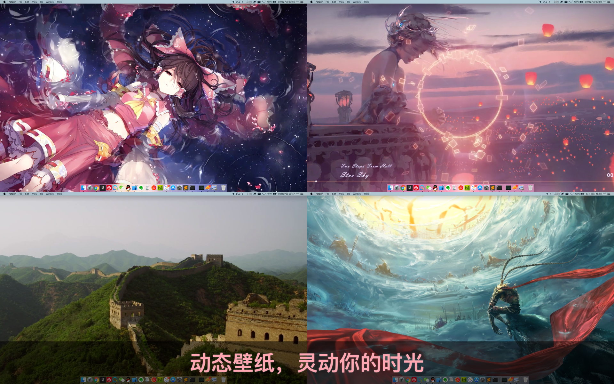

## 花見 - 动态壁纸

花見，是一款Mac平台下的动态壁纸。丰富的动态壁纸，给Mac桌面赋予灵动，同时尽可能少占用系统资源。如果您还在寻找Mac下的动态壁纸，不要犹豫，花見就是您想要的！

花見，使您可以在桌面上使用动态壁纸。既可选择App内现有视频素材，也可导入本地视频，同时可以将视频设置为您的电脑屏保。

#### 下载链接：

[https://apps.apple.com/cn/app/id1456235760](https://apps.apple.com/cn/app/id1456235760)

#### 特性：

● 700+精美视频素材，持续更新，你不必花时间找素材。
● 视频素材分类：4K超清、卡通动漫、自然人文、萌宠萌物、游戏世界、创意视频、怡人尤物、古风古色、影视明星等等，总有适合你的风格。
● 支持“动态屏保”，个性化锁屏，逼格满满。
● 一键导入本地视频，方便快捷。
● 支持播放列表，单循环、列表循环、随机播放模式。
● 支持定时切换，每半小时/一小时/每天自动切换素材。
● 支持多种屏幕宽高比和原始分辨率。
● 支持多显示器，不同屏幕设置不同壁纸。
● 开启智能控制，在使用其他App时自动暂停，工作时不被打扰。
● 当电源未连接电源时自动暂停，节省电量。
● 支持隐藏桌面图标，浸入式的体验。
● 零App学习成本，简洁的交互，追求最好的体验。
● 花見旨在提供有趣的体验，同时尽可能少占用系统资源。

#### 用户评论：

“最好用的动态壁纸软件，其他软件没得比，简直弱爆了，花見的壁纸很多，非常方便选择，功能很强大，外加上团队感觉是很用心的，每次升级都能给软件更好更方便的使用体验，对于问题的回复也很用心很实在，非常棒。” —— Zodiac Sheldon

“一定要支持一下！软件体验很不错，壁纸更新很快，画质也有了提高，最新出的蜘蛛侠动态壁纸真的太好看太喜欢啦，忍不住过来给个好评，日常打开电脑就想先看看有没有新出的壁纸，对我这种壁纸狂魔一天不换都难受的人太友好了，希望开发者继续多出新的酷炫壁纸！” —— Kimentanm

“第二次前来自行5分评价，第一次的评价是建议多更新，开发大大还回复了，看了下其他评价，开发大大基本每个评价都会回复，为工作态度点赞~买之前其实有点担心更新频率的问题，不过现在发现更新得还蛮新快的，例如有最近比较火的鬼灭之刃。就很喜欢~~所以特来支持下，加油哟！” —— Rikka.Sora

"Works like a charm. Lets me play videos as my wallpaper and overall is easy to use. I would suggest to anyone looking for a wallpaper engine like software for mac."  —— mono.mirrorz

"This is a great alternative for Wallpaper Engine and is also incredibly easy to use. The wallpapers are beautiful and clear. The app is updated with different backgrounds often as well. I highly recommend if you have been looking for an app that offers beautiful, dynamic wallpapers! :)" —— HelloMyNameisNickel

【注意】软件内部分素材免费，更多素材需要解锁完整版。如果您觉得物有所值，可以购买我们的完整版。

Privacy policy: 

[
https://hongkongossofwhbalzac.oss-cn-hongkong.aliyuncs.com/privacy/Privacy_Policy_of_4K_Dynamic_Wallpaper.html](
https://hongkongossofwhbalzac.oss-cn-hongkong.aliyuncs.com/privacy/Privacy_Policy_of_4K_Dynamic_Wallpaper.html)

Terms of Use: 

[https://hongkongossofwhbalzac.oss-cn-hongkong.aliyuncs.com/privacy/Terms_of_Use_of_4K_Dynamic_Wallpaper.html](https://hongkongossofwhbalzac.oss-cn-hongkong.aliyuncs.com/privacy/Terms_of_Use_of_4K_Dynamic_Wallpaper.html)